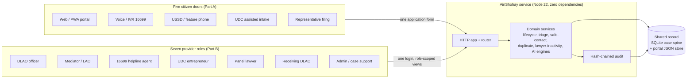
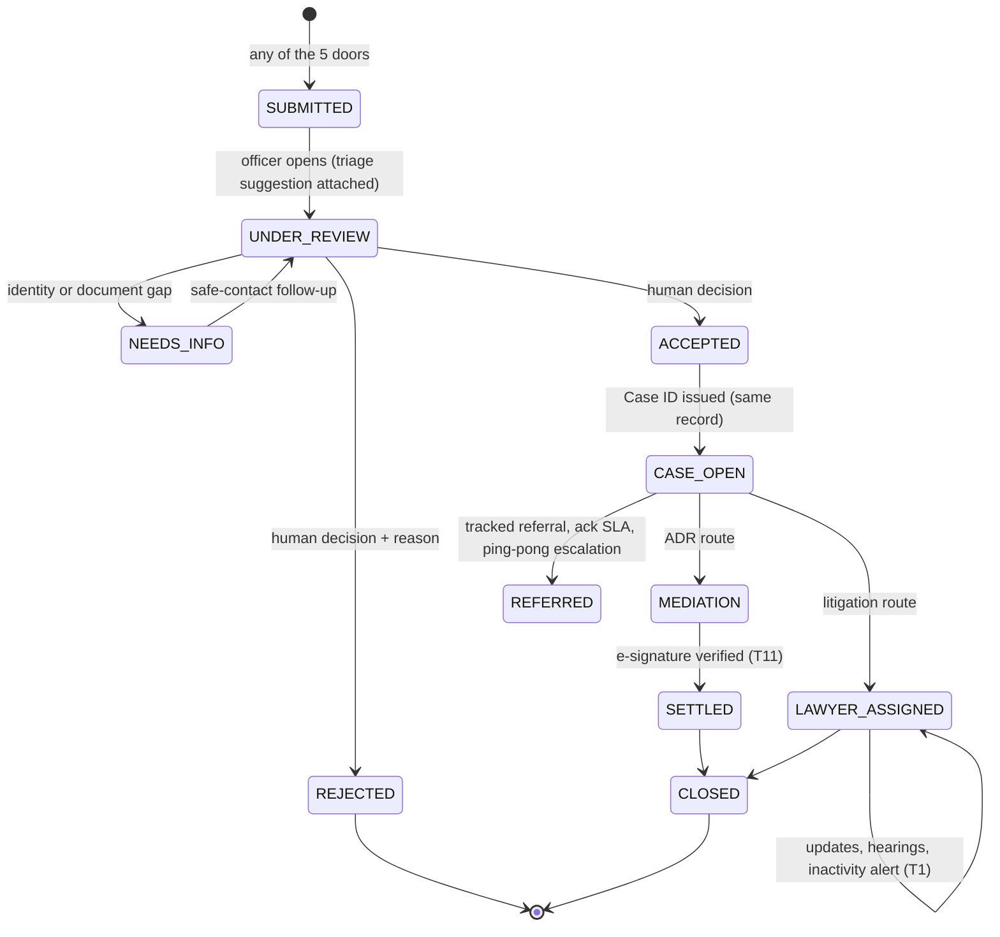
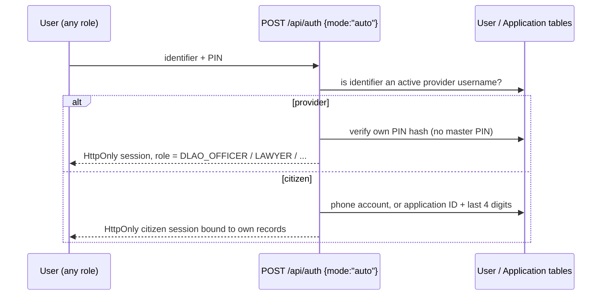

# AinShohay DLAS: System Architecture

**Five Doors, One Record.** One Node.js service and one shared record serve five citizen doors, seven provider roles and eleven technical challenges. This document covers the system design, the record lifecycle and the engineering decisions behind them.

---

Rendered diagrams (SVG/PNG): [11-diagrams.md](./11-diagrams.md). The Mermaid sources below render directly on GitHub.


## 1. System context



## 2. Layered code structure

```
request
  │
  ▼
server.js / api/index.js      entry points (local server | Vercel function)
  │
  ▼
server/app.js                 one request handler: CORS, body, session, errors
  ├── server/http/            respond.js, body.js, static.js (SPA + uploads)
  └── server/router.js        /api/<root> -> handler (dispatch table)
        │
        ▼
server/routes/*.js            thin HTTP handlers, one per API area
        │
        ▼
server/services/*.js          domain logic, shared by every route
        │
        ▼
server/db/sqlite.js           case spine (Application, Case, Task, Audit, ...)
server/db/json-store.js       portal store (accounts, portal applications)
server/domain/constants.js    case types, stages, jurisdictions, templates
server/content/               portal content (199 articles, forms, 67 offices)
server/config.js              ports, paths, serverless storage selection
```

Rules the code follows:

- **Routes stay thin.** They parse, authorise and call services. Business rules live in `services/`.
- **One write path per fact.** An application is written once to the portal store and mirrored into the SQLite case spine in the same request. The result is returned as `storage: { record, caseSpine }`, so a failed mirror is visible to the client and in the logs instead of being silently ignored.
- **Every decision is audited.** `services/audit.js` appends `AuditEntry` rows (actor, channel, on whose authority, entity). Each row stores `prevHash` and `entryHash = SHA-256(prevHash + fields)`. `GET /api/audit/verify` recomputes the chain and names the first modified or removed row; a test proves tampering is detected.
- **Offline-first.** The browser keeps unsent applications in an outbox and syncs them through `/api/sync_push` with a client UUID. Replays are idempotent, and synced records use the same creation path as online ones.
- **AI never decides.** Triage, intake, document briefs and settlement drafts return suggestions with provenance. Acceptance, rejection, priority and legal advice always need a named human actor.

## 3. Application to case lifecycle



## 4. One login, bounded access



- There is one login form for everyone. The server decides the account type, so there are no separate portals to maintain or confuse.
- Role-scoped views of the **same** record: the helpline sees status and next step, UDC sees a limited post-submission view, a lawyer sees hearings and tasks, and sensitive records are blocked for roles without need-to-know (the denial is audited).
- The console's "view as role" switch is restricted to authenticated provider sessions. A citizen session gets `403` (covered by a test).
- A central guard in `server/router.js` refuses anonymous (401) and citizen (403) reads of case-spine routes.
- 5 wrong PINs lock an identifier for 10 minutes; the lockout is written to the audit chain.

## 5. Data and persistence

| Store | Holds | Location |
|---|---|---|
| SQLite (`node:sqlite`) | Applicant, Application, Case, Task, AuditEntry, Consent, ContactRule, Referral, LawyerAssignment, Hearing, MediationSession, SettlementDraft, SignatureRecord, OfflineSyncRecord, ... (30 tables) | `DATA_DIR/dev.db` |
| JSON store | Citizen accounts, portal applications, portal sessions | `DATA_DIR/app-db.json` |
| Uploads | Evidence files per application | `DATA_DIR/uploads/<appId>/` |

`DATA_DIR` is `./data` locally and `/tmp/ainshohay` on Vercel, the only writable path there. The committed `data/app-db.json` is the seed and is copied on cold start. **Limitation:** on the free serverless plan, data written by users lasts only while an instance is warm. For a pilot, point `DATA_DIR` at a persistent volume (Railway, Render, a VPS), or swap `server/db/*` for managed Postgres. The service layer does not change.

## 6. Mapping to the judging criteria

| Criterion | Where it lives |
|---|---|
| System integration & architecture (20%) | One service, one router, one shared record; every door writes the same Application and every role reads it (sections 1 to 3) |
| Technical quality & reliability (20%) | Layered code, explicit error reporting on writes, 30 smoke + 20 API tests, Vercel runtime simulation (`npm run check:vercel`) |
| Service improvement / legal impact (15%) | Free-service notice, safe contact, tracked referrals with acknowledgement SLA, lawyer inactivity alerts, mediation with verified e-signature |
| Innovation (10%) | Multi-agent triage with human sign-off, provenance per field (applicant, representative, intermediary, staff, AI), jurisdiction ping-pong escalation |
| Inclusion & accessibility (10%) | Voice/IVR, USSD, UDC-assisted and representative doors; Bangla-first UI; low-bandwidth PWA; offline sync with integrity checks |
| Privacy, safety & responsible AI (10%) | HttpOnly sessions, no master PIN, role-bounded views, sensitive-record gating, hash-chained audit, AI output labelled and never final |
| Feasibility & scalability (10%) | Zero dependencies, runs on the Vercel free plan; storage behind `server/db/` so it can move to Postgres; schema mirrors the Prisma model in `legacy/nextjs-backend` |
| Presentation (5%) | `/api/coverage` lists all 23 requirements with the console view that demonstrates each |

## 7. Ideas for the next iteration

1. Merge the two stores into the SQLite spine (portal applications become rows, so there is no mirroring).
2. Add a Postgres adapter behind `server/db/` for persistent multi-instance hosting.
3. Add SMS gateway, USSD aggregator and NID/porichoy adapters. These are currently labelled simulations.
4. Move the login throttle and sessions to the database or Redis for multi-instance deployments.
5. Queue evidence files offline too (IndexedDB), not only form data.
