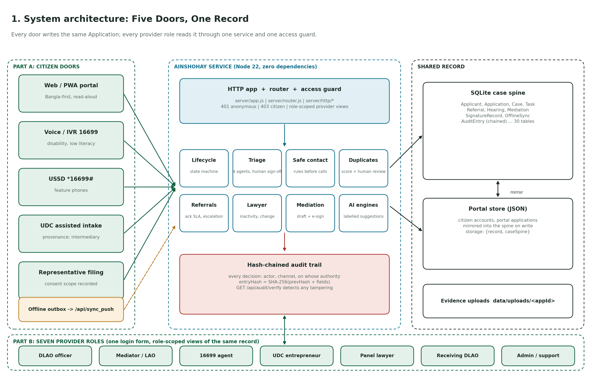
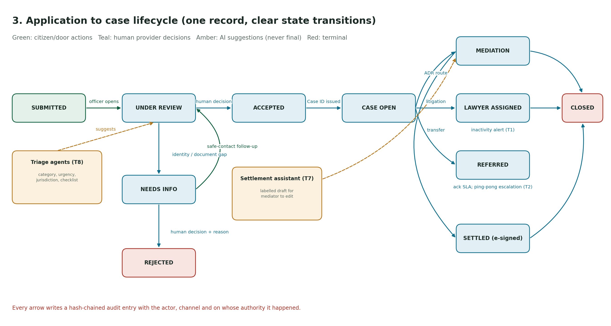
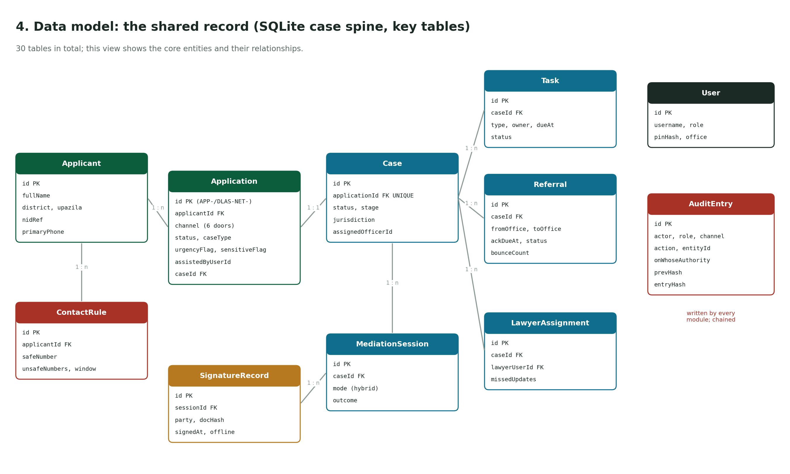
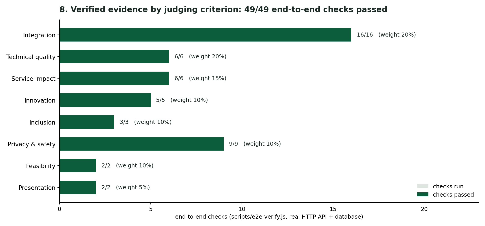

# Diagrams and charts

All diagrams are generated from code (`scripts/generate-diagrams.py`) as SVG (scalable, for print and slides) and PNG. The two charts are built from a real end-to-end run against the API and database, not typed-in numbers. The running app also shows them at **`/architecture.html`**.

Regenerate:

```bash
node scripts/e2e-verify.js --json context/diagrams/verification-report.json   # 49 checks
python3 scripts/generate-diagrams.py                                             # needs matplotlib
```

| # | Diagram | What it shows |
|---|---|---|
| 1 | [System architecture](./diagrams/01-system-architecture.png) | Five doors and the offline outbox feed one service (router + access guard, 8 domain services, hash-chained audit) that writes one shared record read by seven provider roles |
| 2 | [Code layers](./diagrams/02-code-layers.png) | Entry points, HTTP app, router/guard, thin routes, services, data access, domain/content |
| 3 | [Case lifecycle](./diagrams/03-case-lifecycle.png) | State machine from SUBMITTED to CLOSED; human decisions vs AI suggestions |
| 4 | [Data model](./diagrams/04-data-model.png) | Core tables of the SQLite case spine and their relationships |
| 5 | [Login & access](./diagrams/05-login-and-access.png) | One login, throttle, provider/citizen resolution, access-guard matrix |
| 6 | [Deployment](./diagrams/06-deployment.png) | Vercel CDN + serverless function + /tmp storage; persistent-host option |
| 7 | [Offline sync](./diagrams/07-offline-sync.png) | Capture, outbox, reconnect, idempotent sync, same creation path |
| 8 | [Evidence by criterion](./diagrams/08-verification-by-criterion.png) | 49/49 end-to-end checks grouped by the 8 judging criteria |
| 9 | [Records by door](./diagrams/09-records-by-door.png) | Case-spine applications per channel after the run (one record, many doors) |

The raw results are in [diagrams/verification-report.json](./diagrams/verification-report.json).





